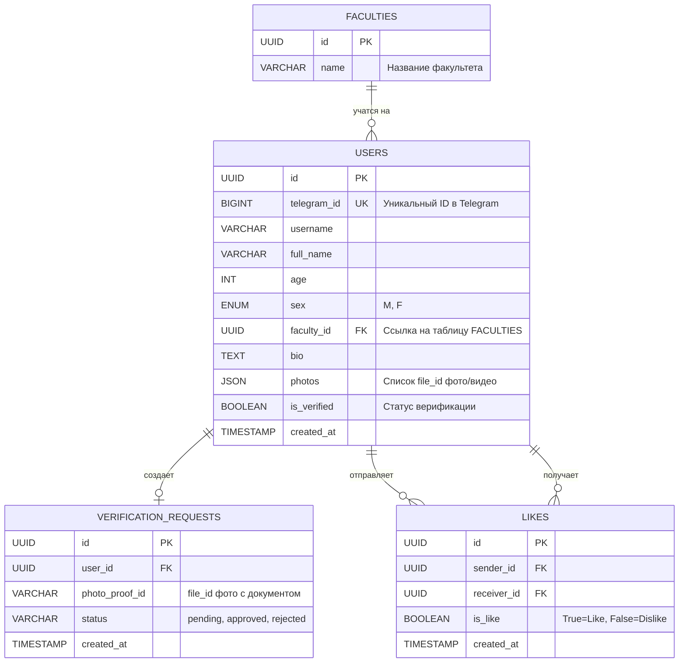
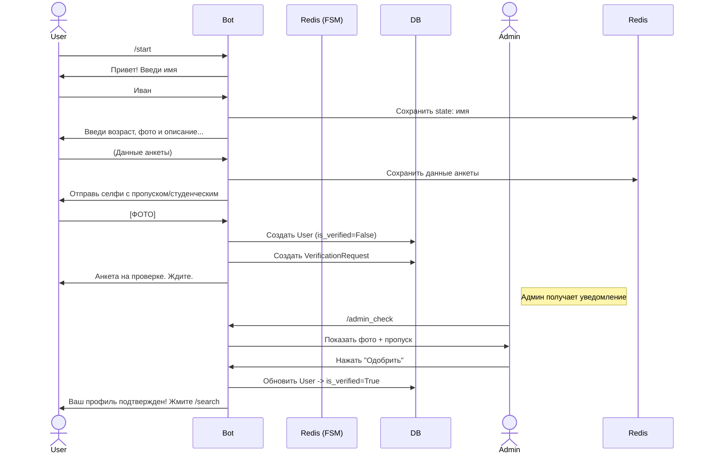
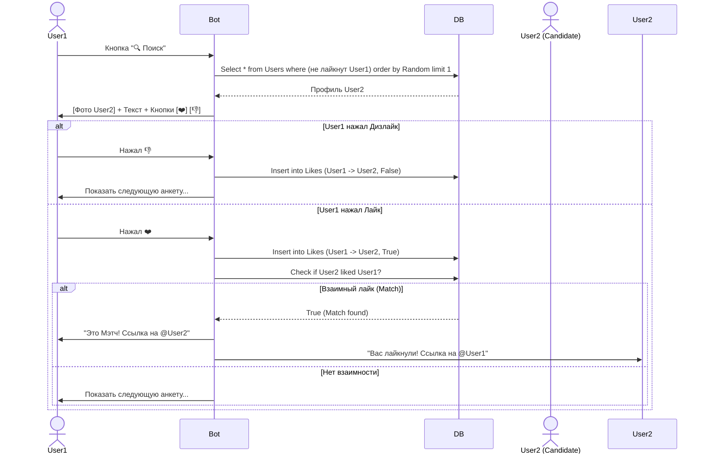

# Техническая документация: DateMate

## 1. Описание проекта

**DateMate** — это бот для знакомств в Telegram внутри университета НИУ ВШЭ, реализующий механику приложения Tinder. Пользователи могут создавать анкеты, просматривать анкеты других людей и ставить лайки/дизлайки. При взаимном лайке пользователи получают уведомление и ссылки на профили друг друга.

### Основной функционал:
1.  **Регистрация:** Заполнение анкеты (Имя, Возраст, Пол, Факультет, Описание, Фото/Видео).
2.  **Верификация:** Обязательная отправка селфи с документом (студенческий/пропуск) для подтверждения личности.
3.  **Поиск:** Просмотр карточек случайных пользователей.
4.  **Взаимодействие:** Кнопки "Лайк" (❤️) и "Дизлайк" (👎).
5.  **Мэтчинг:** Уведомление о совпадении пар.

---

## 2. Стек технологий

*   **Язык:** Python 3.10+
*   **Фреймворк бота:** aiogram 3.x
*   **База данных:** PostgreSQL
*   **ORM:** SQLAlchemy
*   **Хранение состояний и кэш:** Redis
*   **Контейнеризация:** Docker, Docker Compose
*   **Тестирование:** pytest
*   **Архитектура:** Domain Driven Design (DDD)

---

## 3. Архитектура (Domain Driven Design)

Проект разделен на слои для обеспечения гибкости, тестируемости и чистоты кода.

### Структура слоев:
1.  **Presentation Layer (Телеграм бот):**
    *   Хендлеры (Handlers) aiogram.
    *   Клавиатуры (Keyboards).
    *   Middleware.
    *   Отвечает только за прием сообщений от Telegram и отправку ответов.
2.  **Application Layer:**
    *   Бизнес-сценарии (Use Cases).
    *   Оркестрация логики (например, `RegisterUser`, `RateProfile`, `VerifyUser`).
    *   Не зависит от фреймворка бота или конкретной БД.
3.  **Domain Layer:**
    *   Сущности (Entities) и Модели данных (Pydantic/DataClasses).
    *   Интерфейсы репозиториев (абстракции).
    *   Чистая бизнес-логика.
4.  **Infrastructure Layer:**
    *   Реализация репозиториев (SQLAlchemy models).
    *   Подключение к БД и Redis.
    *   Внешние сервисы (API), но возможно их и не будет.

---

## 4. База данных

### Немного инфы
*   **Секреты:** Логин, пароль, хост и имя БД хранятся в файле `.env`, который добавлен в `.gitignore`. В коде будут подгружаться через `os.getenv`.
*   **Подключение:** Полностью асинхронное через драйвер `asyncpg`.
*   **ORM:** Использование SQLAlchemy

### Схема БД

---

## 5. Пользовательские сценарии и взаимодействие

### 5.1. Сценарий регистрации и верификации
Пользователь заходит в бота, заполняет анкету и отправляет фото с документами. Пока модератор не подтвердит, доступ к поиску закрыт.

### 5.2. Сценарий поиска и матчинга (Основной интерфейс)
Пользователь видит анкету. Если ставит лайк, и тот человек тоже лайкнул — происходит Match.

---

## 6. План разработки и распределение задач

**Команда:**
*   **Дарья (Team Lead):** Архитектура, DevOps, Code Review, Базовая логика, Управление репозиторием.
*   **Федор (Developer):** Реализация бизнес-логики, работа с БД, Тесты.

### Backlog (Задачи)

| Задача | Описание | Оценка времени | Исполнитель |
| :--- | :--- | :--- | :--- |
| **1. Инициализация проекта** | Настройка репозитория, Pip, линтеры (flake8), настройка `.gitignore`. | 2 часа | **Дарья** |
| **2. Настройка Docker** | Написание `Dockerfile` и `docker-compose.yml` (Bot + Postgres + Redis). | 3 часа | **Дарья** |
| **3. Архитектура БД** | Создание моделей SQLAlchemy. | 4 часа | **Дарья** |
| **4. Базовый бот** | Подключение aiogram, настройка Middleware, структура папок DDD. | 3 часа | **Федор** |
| **5. FSM Регистрации** | Стейты: ввод имени, возраста, фото, био. Валидация данных. | 6 часов | **Федор** |
| **6. Механика Верификации** | Логика приема фото документа, создание заявки, админ-хендлеры для аппрува. | 5 часов | **Федор** |
| **7. Логика поиска** | SQL запрос для выборки кандидатов (исключая тех, кого уже видели). Вывод карточки. | 6 часов | **Федор** |
| **8. Лайки и Мэтчинг** | Обработка коллбэков лайк/дизлайк. Проверка на взаимность. Рассылка уведомлений. | 5 часов | **Дарья** |
| **9. Тестирование** | Написание unit-тестов для сервисного слоя и интеграционных тестов БД. | 8 часов | **Федор** |
| **10. Финализация** | Документация, проверка безопасности (ENV), финальный деплой и прогон демки проекта. | 4 часа | **Дарья** |