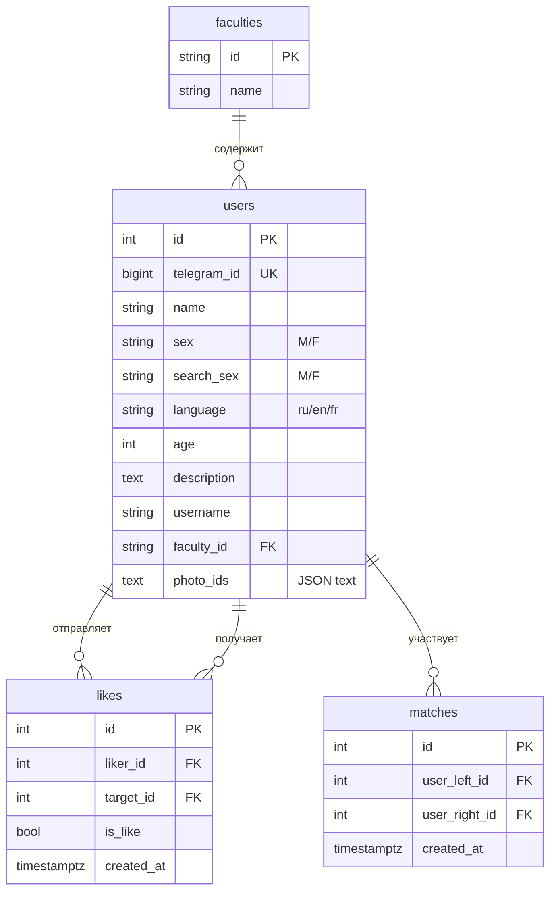
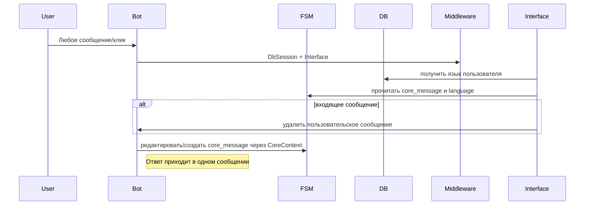
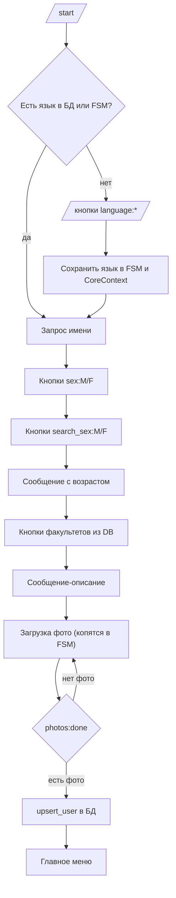
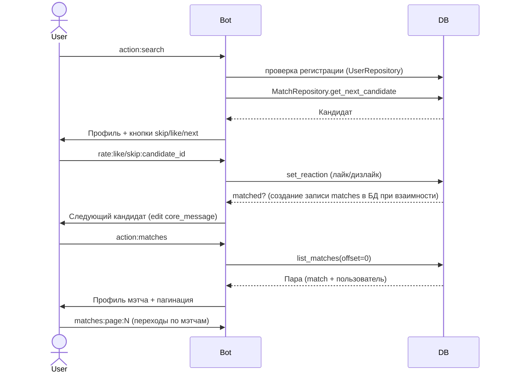

# Техническая документация: DateMate

## 1. Описание проекта

**DateMate** — Telegram-бот для знакомств внутри НИУ ВШЭ. Бот построен вокруг принципа **Single Message per dialog**: у пользователя в чате поддерживается только одно единственное сообщение, которое редактируется при каждом действии. Функции, реализованные в текущем коде:

1. **Регистрация/редактирование анкеты.** Шаги: выбор языка → имя → пол → кого ищет → возраст → факультет → описание → загрузка фото. Данные сохраняются в PostgreSQL через SQLAlchemy.
2. **Поиск пользователей.** Выдача кандидатов с учетом пола и уже поставленных реакций.
3. **Лайки/дизлайки и мэтчи.** Результаты сохраняются, при взаимном лайке формируется запись о мэтче и пользователь видит карусель своих мэтчей.
4. **Поддержка нескольких языков интерфейса** (ru/en/fr) через JSON файлы с фразами.

---

## 2. Стек технологий

- **Язык:** Python 3.10+
- **Фреймворк бота:** aiogram 3.x (asyncio)
- **База данных:** PostgreSQL
- **ORM:** SQLAlchemy (асинхронные сессии, `asyncpg`)
- **Хранение состояний:** aiogram FSM (по умолчанию `MemoryStorage`, но можно и Redis)
- **Кэш/Throttling:** `cachetools.TTLCache` в middleware
- **Контейнеризация:** Docker, Docker Compose
- **Архитектура:** Domain Driven Design (DDD)

---

## 3. Архитектура (DDD)

- **Presentation (tgbot):** хендлеры aiogram, inline-клавиатуры, загрузка фраз, middleware, FSM состояния регистрации.
- **Domain:** сущности (`Faculty`), то есть факультеты пользователя, абстракции и репозитории для Users/Matches/Likes/Faculties.
- **Infrastructure:** SQLAlchemy-модели и фабрика сессий, инициализация БД с дефолтными факультетами.

---

## 4. База данных

- **Инициализация.** При старте `init_db` создает таблицы и записывает дефолтные факультеты ВШЭ (`fkn`, `fen`, `vsb`, `fgn`).
- **Хранение фото.** `UserModel.photo_ids` — текстовое поле с JSON-массивом file_id Telegram.
- **Мэтчи.** Пара хранится в отсортированном виде (`user_left_id <= user_right_id`) с ограниченнием, при этом пользователю в ленте попадаются сначала люди, которые его уже лайкнули, чтобы мэтчи могли происходить быстрее.

---

## 5. Middleware и Single Message per dialog

### DbSessionMiddleware (`tgbot/middlewares/db.py`)

- Создает `AsyncSession` из `session_factory` для каждого апдейта и кладет в `data["session"]`.
- Жизненный цикл сессии просто ограничен обработчиком события (контекстный менеджер `async with`).

### InterfaceMiddleware (`tgbot/middlewares/interface.py`)

- Достает язык пользователя (переводит фразы бота на другие языки): сначала из БД (`UserRepository.get_by_telegram_id`), затем из FSM (`language`), затем из провайдера фраз по умолчанию, если что-то пошло не так.
- Инициализирует `CoreContext`, пробрасывает `phrases` и `phrases_provider` в `data` для хендлеров.
- Реализует Single Message per dialog: хранит `core_message` в FSM и редактирует его при каждом ответе, пользовательские сообщения удаляются, чтобы в чате оставалось только одно системное сообщение.
- Если последнее главное сообщение старше 48 часов — очищает состояние FSM, удаляет сообщение и отправляет фолбэк типа вернуться в меню.

### ThrottlingMiddleware (`tgbot/middlewares/throttling.py`)

- Ограничивает частоту сообщений по `chat.id` через `TTLCache`, при срабатывании просто игнорирует событие.

---

## 6. Репозитории SQLAlchemy

### FacultyRepository

- `list_faculties()` — возвращает все факультеты.
- `get_by_id(faculty_id)` — ищет факультет по идентификатору.

### UserRepository

- `get_by_telegram_id(telegram_id)` — достает пользователя по Telegram ID.
- `get_by_id(user_id)` — достает пользователя с `selectinload` факультета.
- `upsert_user(...)` — создает или обновляет анкету, записывает все поля, фото и имя пользователя Telegram, коммитит и возвращает свежую модель.

### MatchRepository

- `get_next_candidate(user)` — отдает следующего кандидата, избегая уже оцененных; приоритет — те, кто уже лайкнул пользователя.
- `set_reaction(liker_id, target_id, is_like)` — создает/обновляет лайк, проверяет встречный лайк и при необходимости создает запись в `matches`.
- `count_matches(user_id)` и `list_matches(user_id, offset, limit)` — пагинация мэтчей с подгрузкой анкет второй стороны.

---

## 7. FSM и ходы состояний

Пока что для FSM используется просто aiogram FSM, который доступен по умолчанию и хранит стейты в памяти MemoryStorage, в будущем планируется переход на Redis.
Вот некоторые переходы и стейты, которые есть в боте и уже реализованы:

### OnboardingState

- **language**: активируется при `/start`, если язык еще не выбран и пользователя нет в БД. Выбор inline-кнопкой `language:*` сохраняет язык в FSM (`language`) и в `CoreContext`, после чего состояние сбрасывается и показывается главное меню.

### RegistrationState

- **language** → **name** → **sex** → **search_sex** → **age** → **faculty** → **description** → **photos**.
- Каждое значение временно сохраняется в `FSMContext` (например, `sex`, `search_sex`, `photo_ids`).
- На шаге `faculty` список опций загружается из БД через `FacultyRepository`.
- На `photos` накапливается список `photo_ids`, завершение происходит по кнопке `photos:done`, где вызывается `UserRepository.upsert_user(...)` и показывается главное меню.

### Ключи в FSM

- `core_message` — идентификатор единственного (главного) сообщения в диалоге (используется через `CoreContext.respond_*`).
- `language` — выбранный язык интерфейса.

Для поиска и просмотра мэтчей отдельные состояния не используются: события обрабатываются сами по себе, просто опираясь на записи в БД и сохраненный `core_message`.

---

## 8. Техническая схема диалога

### Single Message

### Регистрация

### Поиск и мэтчи

---

## 9. План разработки и распределение задач

| Задача                  | Описание                                             | Оценка времени | Исполнитель |
| :---------------------- | :--------------------------------------------------- | :------------- | :---------- |
| Базовая инфраструктура  | Docker/Docker Compose, настройки окружения           | 5 минут        | Дарья       |
| Инициализация БД        | SQLAlchemy модели, сиды факультетов                  | 30 минут       | Дарья       |
| Онбординг и регистрация | FSM, валидация полей, загрузка фото                  | 1 час          | Федор       |
| Поиск и мэтчинг         | Лайки/дизлайки, выдача кандидатов, сохранение мэтчей | 1 час          | Федор       |
| UI и локализация        | Пакет фраз ru/en/fr, клавиатуры                      | 3 часа         | Совместно   |
| Тестирование и отладка  | unit/интеграционные тесты, прогон сценариев          | 5 часов        | Федор       |
